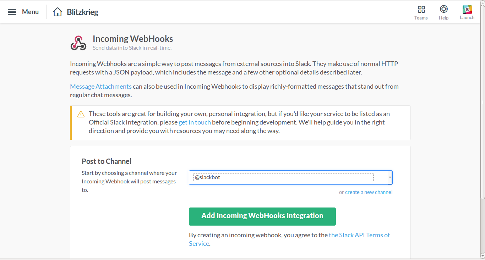
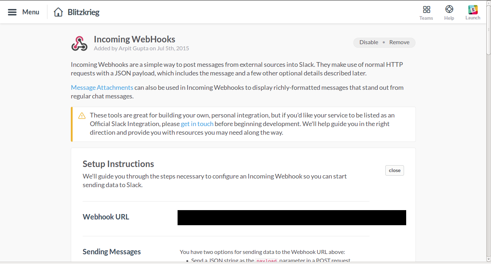
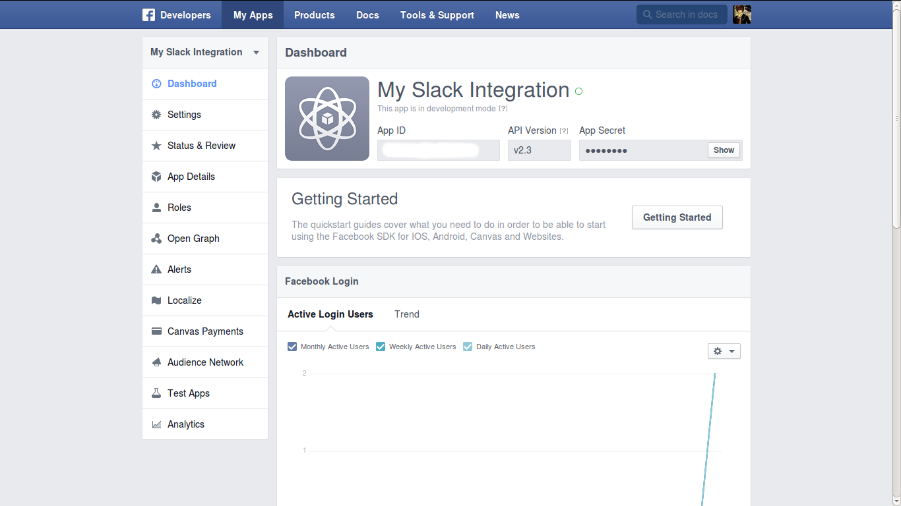
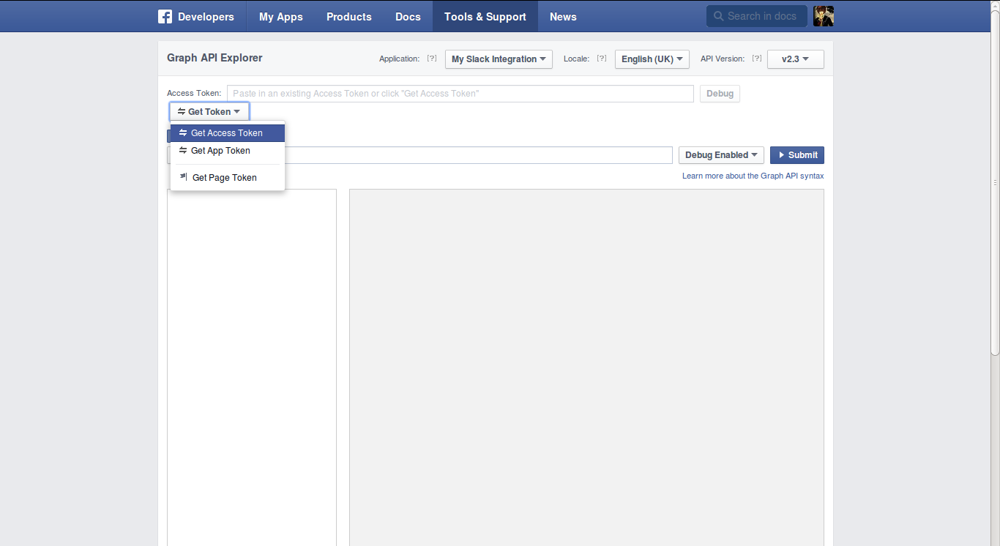
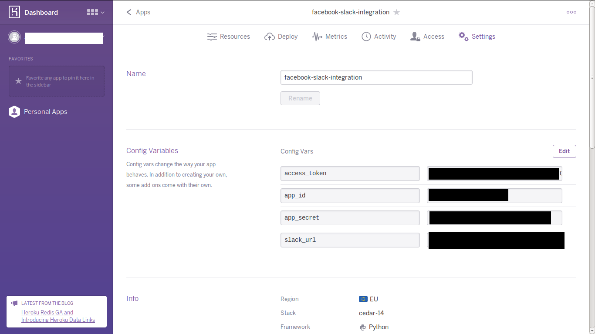

## Facebook-Slack-Integration

Purpose of this integration is to receive a message on Slack for new Notifications and Messages received on Facebook.

## Installing Facebook-Slack-Integration for your slack

1. Obtaining Slack Incoming Webhook url:
	* Go to `https://<your-team-name>.slack.com/services/new/incoming-webhook`.
	* Choose `@slackbot` as channel and add Incoming Webhook Integration.
	
	* Copy the Webhook URL and enter it as `slack_url` in config variables at deployment stage.
	* Customize the webhook with your favorite name and icon (Facebook Favicon included) and save.
	

2. Obtaining Facebook App ID and App Secret:
	* Go to [Facebook Developers](https://developers.facebook.com/quickstarts/?platform=web) and register.
	* Follow instructions and create a new web app. 
	* On you app's page, Copy the App ID and enter it as `app_id` in config variables at deployment stage.
	* Copy the App Secret and enter it as `app_secret` in config variables at deployment stage.
	
	
3. Obtaining Facebook User Access Token:
	* Go to [Facebook Graph Explorer Tool](https://developers.facebook.com/tools/explorer/).
	* Select your fb app in application dropdown and click 'get token' > 'get access token'.
	* Select `user_about_me` permission and from extended permissions select `manage_notifications` , `read_mailbox` , `read_stream`
	* Click `get access token` and enter the token generated as `access_token` in config variables  at deployment stage.
	

4. Deploying
	* Deploy on [heroku](https://www.heroku.com/) by creating a [new app](https://dashboard.heroku.com/new).
	* Set config variables `slack_url` `app_id` `app_secret` `access_token` in the settings tab of your app.
	

	* Fork and clone this repository to you local. 
	* Add heroku remote to your local repo using the deploy instructions in the deploy tab of your heroku app.
	* Push to remote using command:  `git push heroku master`
	* Run command to start your app: `heroku ps:scale clock=1`

## Using Facebook-Slack-Integration with slack

After deploying, Facebook-Slack-Integration will keeping running as a background worker and checking new fb messages every 10 mins while checking new fb notifications every 1 hour to keep you updated at your chosen slack channel for the webhook.

## Limitations

You will need to re-generate your facebook access token (step 3) every 2months. This is a restriction made by fb api for security reasons.

## Support or Contact

Having trouble with Facebook-Slack-Integration? Create an issue in the repository GitHub Repo.

